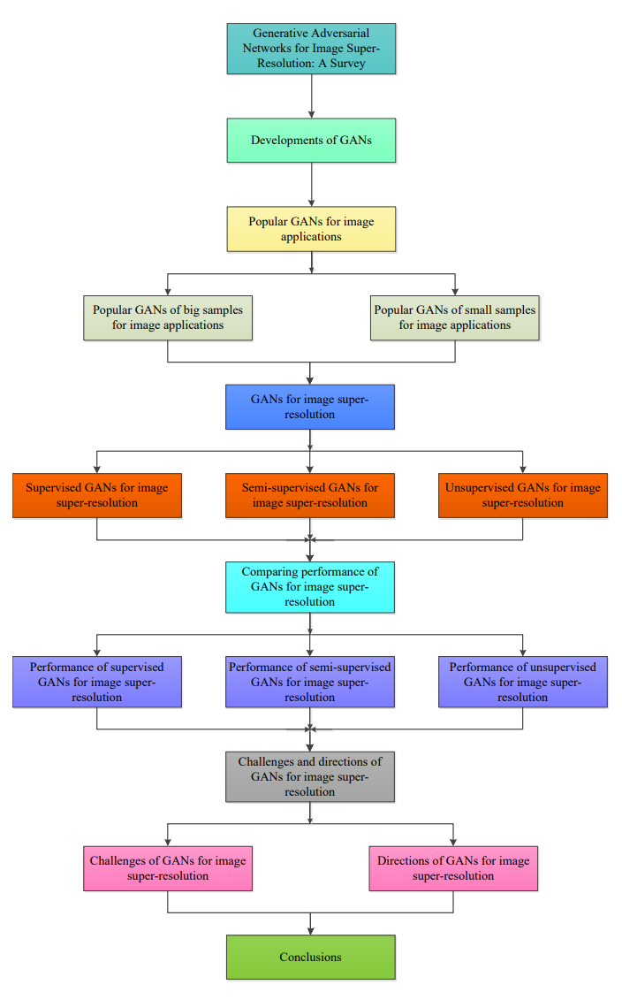
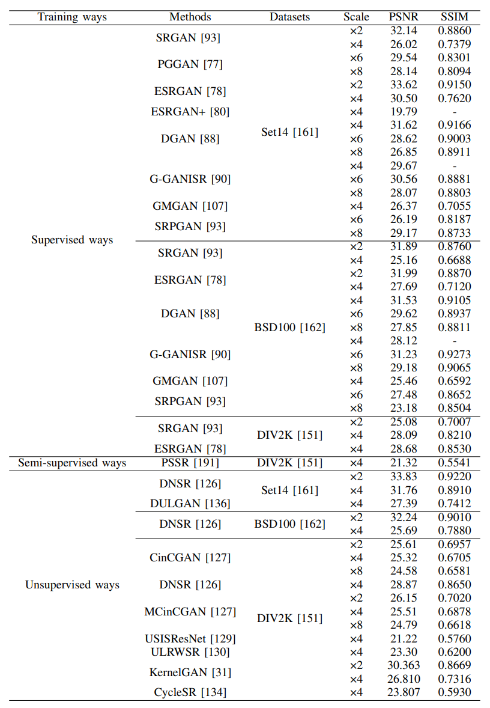

用于图像超分辨率的生成对抗性网络：综述

---

此 paper 专注于 **单图像超分辨率（SISR）**

**SRGAN:** https://arxiv.org/abs/1609.04802

**PGGAN:** https://arxiv.org/abs/1710.10196

**ESRGAN:** https://arxiv.org/abs/1809.00219

**ESRGAN+:** https://arxiv.org/abs/2001.08073

**DGAN:** https://faculty.uca.edu/ecelebi/documents/SPIC_2019.pdf

**G-GANISR:** 

