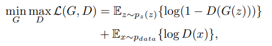

Coupled Adversarial Training for Remote Sensing Image Super-resolution

---

本文主要贡献为：提出了 CDGAN（耦合判别生成对抗性网络）。
1. 不同于常见的 超分辨率 GAN 中鉴别器一次获取单个输入图像，而是同时获取一对图像，
实现了更好的对输入图像低频区域的识别。
2.在鉴别器中加入了三个附加的技术组件，包括 “dual pathway network architecture”，
“random gate”，“coupled loss function” ，获得更好的辨别能力，并帮助对应关系。

---

首先，GAN 的训练可以被视为：

 

